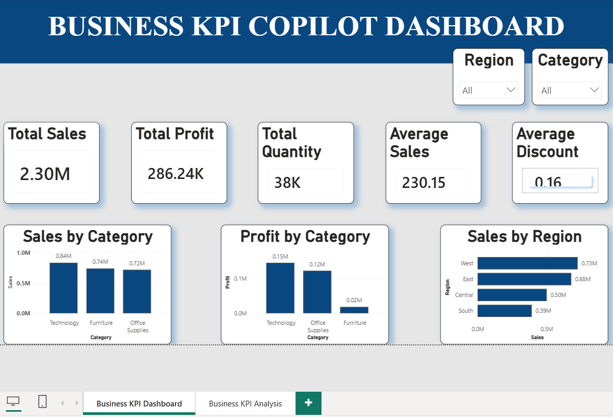
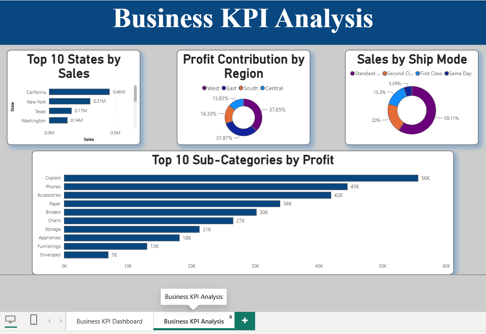

# Business KPI Copilot Dashboard


Interactive Business KPI Dashboard using Power BI, Python, Excel and Jupyter Notebook for Sales, Profit and Regional Analysis.

---

## Project Overview

This project transforms raw business sales data into meaningful insights through data preprocessing, KPI analysis, SQL queries, and interactive Power BI dashboards. It helps analyze sales, profit, quantity, discounts, regional performance, shipping modes, and product categories.

---

## Features

- Data Cleaning & Preprocessing
- KPI Analysis
- Interactive Power BI Dashboard
- Sales & Profit Analysis
- Region-wise Performance
- Category-wise Analysis
- Shipping Mode Analysis
- Top States & Sub-Categories Analysis

---

## Tech Stack

- Python
- Pandas
- NumPy
- SQL
- Jupyter Notebook
- Microsoft Power BI

---

##  Project Structure

```text
Business-KPI-Copilot/
│
├── data/
├── notebooks/
├── powerbi/
├── images/
└── README.md
```

---

# Dashboard Preview

## Dashboard Page 1



### Includes
- Total Sales
- Total Profit
- Total Quantity
- Average Sales
- Average Discount
- Sales by Category
- Profit by Category
- Sales by Region
- Region & Category Filters

---

## Dashboard Page 2



### Includes
- Top 10 States by Sales
- Profit Contribution by Region
- Sales by Ship Mode
- Top 10 Sub-Categories by Profit

---

## Key Insights

- Technology category generated the highest sales.
- West region contributed the highest revenue.
- Standard Class shipping was used most frequently.
- California recorded the highest sales.
- Technology and Office Supplies generated the highest profit.

---

## Future Improvements

• Add AI Forecasting

• Real-time Dashboard

• SQL Database Integration

• Power BI Service Deployment

• Mobile Responsive Dashboard

---

## Future Scope

- Sales Forecasting
- Customer Segmentation
- AI-based Business Recommendations
- Predictive Analytics

---

##  Contact

**Developed by:** Rishika Upadhyay

GitHub: https://github.com/rishika-upadhyay

LinkedIn: https://www.linkedin.com/in/rishika-upadhyay-856401326?utm_source=share_via&utm_content=profile&utm_medium=member_android

⭐ If you like this project, consider giving it a **Star** on GitHub.
